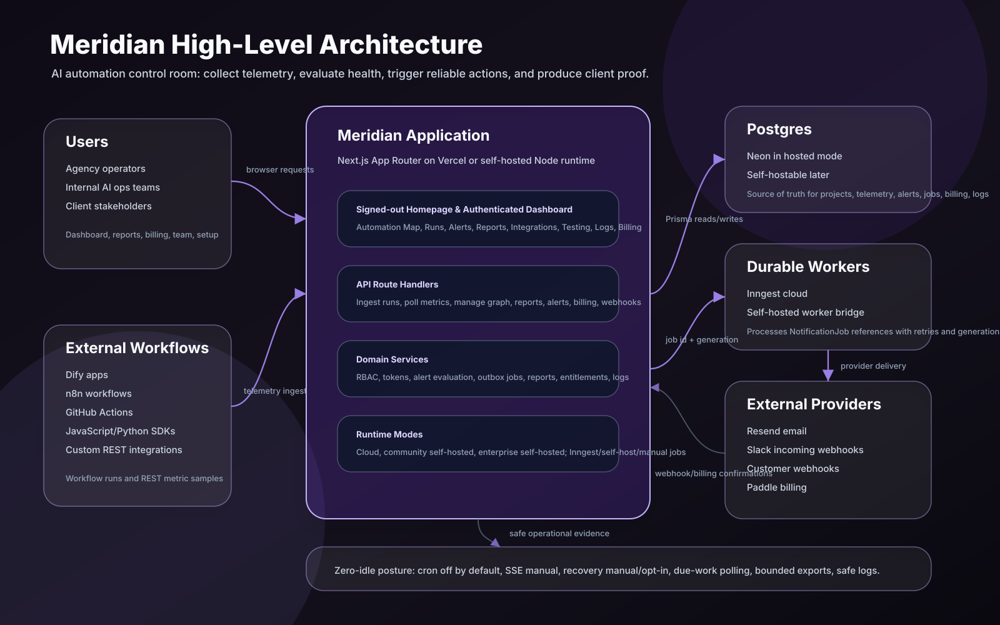
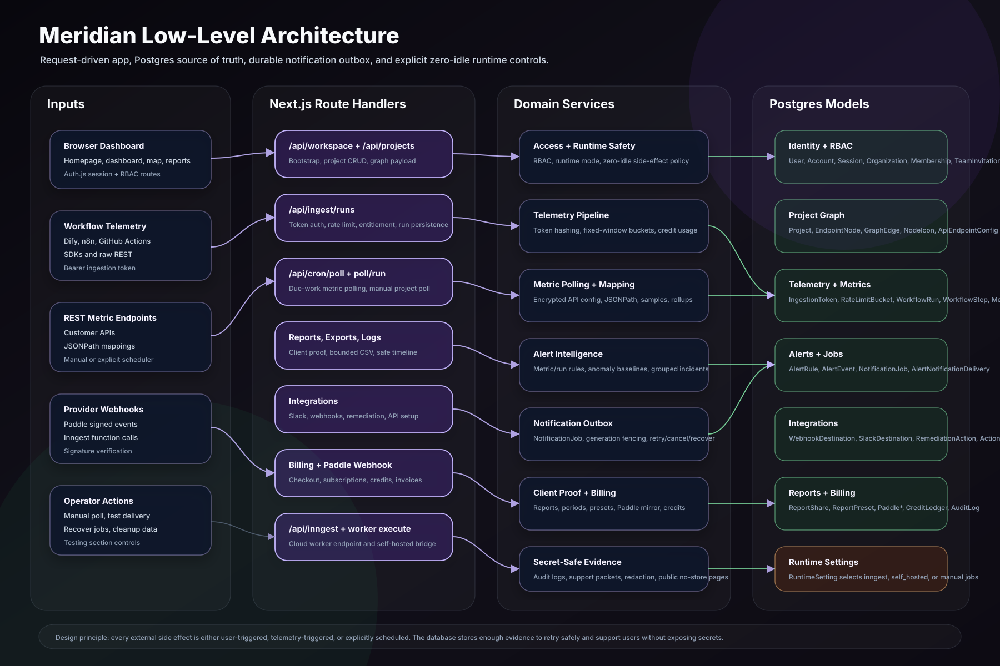

# Meridian Architecture Storyboard

This document explains Meridian’s architecture in a storyboard style: what the product is, why each technical decision exists, what problems appeared while building it, and how those problems shaped the current design.

Use this together with the two architecture pictures:

- [High-Level Architecture](./MERIDIAN_HIGH_LEVEL_ARCHITECTURE.svg)
- [Low-Level Architecture](./MERIDIAN_LOW_LEVEL_ARCHITECTURE.svg)





## Executive Summary

Meridian is an AI automation control room for agencies and teams. It monitors automations built elsewhere, such as Dify apps, n8n workflows, GitHub Actions, SDK-instrumented scripts, and REST APIs. It turns operational evidence into alerts, logs, usage summaries, and client-facing proof reports.

The central architectural idea is:

> Meridian should not be the workflow engine. Meridian should be the operational truth layer around workflow engines.

That decision explains most of the architecture:

- External systems keep running the actual workflows.
- Meridian receives workflow-run telemetry or polls REST metric endpoints.
- Postgres becomes the source of truth for evidence.
- Alert evaluation happens on persisted evidence.
- Notifications are queued through a durable outbox.
- Reports and logs are generated from sanitized summaries, not secrets.
- Idle background work is off by default unless a real pilot/customer enables it.

## Scene 1: The Product Problem

### What We Were Building

AI automation agencies can build workflows quickly, but they struggle to prove those workflows are:

- Running reliably.
- Saving time or cost.
- Not silently failing.
- Not getting expensive through token/cost spikes.
- Worth reporting to clients every month.

### Why Existing Tools Were Not Enough

Dify, n8n, GitHub Actions, and custom scripts are good at running workflows. They are not focused on agency-grade client proof across multiple workflow systems.

An agency needs to answer questions like:

- Which automations are live?
- Which one failed?
- How much did this automation cost today?
- How many tokens did it consume?
- Did success rate improve from last month?
- Can I show this to a client without exposing secrets?

### Architectural Decision

Meridian became a graph-first monitoring and proof layer rather than a workflow builder.

### Why

This keeps the product compatible with many workflow systems. It also lets Meridian focus on observability, reliability, and reports instead of competing with every automation platform.

### Problem Faced

If Meridian does not execute workflows, it needs a simple way to receive evidence from many different systems.

### Solution

Meridian supports two evidence paths:

1. Workflow telemetry ingestion through `/api/ingest/runs`.
2. REST metric polling through node API configuration and JSONPath mappings.

## Scene 2: Graph-First Workspace

### What Users See

Authenticated users land on the Automation Map by default. Each node represents a workflow, API, agent, service, or automation endpoint.

### Why A Graph

Agencies and ops teams think in systems:

- This chatbot depends on this knowledge source.
- This workflow sends results to this CRM.
- This API powers this client deliverable.

A graph makes those relationships understandable in a way a table cannot.

### Technical Implementation

- React Flow powers the map.
- Endpoint nodes are custom rendered in `src/components/meridian/endpoint-node.tsx`.
- Graph state is persisted with Prisma models:
  - `EndpointNode`
  - `GraphEdge`
  - `NodeIcon`
  - `NodeStatusOverride`
  - `ApiEndpointConfig`
  - `ParameterMapping`

### Why Edges Are Visual Only

Meridian intentionally does not use graph edges to determine execution order.

### Why

If Meridian made edges executable, it would become a workflow engine. That would create:

- More complexity.
- More failure responsibility.
- More security risk.
- More coupling to user infrastructure.

Visual edges give context without taking over execution.

### Problem Faced

Users needed to show flow relationships and label handoffs, but early invisible React Flow handles were hard to discover.

### Solution

Every node now has visible input and output handles. In Edit mode users can drag a wire from output to input, and click an edge to edit its label. View mode shows the handles but does not allow mutation.

## Scene 3: Workspace And Team Model

### What Exists

Meridian is team-first:

- `Organization`
- `Membership`
- `Project`
- `TeamInvitation`
- Roles: owner, admin, member, viewer.

### Why

Agencies are not single-user tools. A founder, engineer, ops teammate, and client-facing person may all need different levels of access.

### Technical Implementation

Access is controlled through shared helpers:

- `assertProjectAccess`
- `assertProjectRole`
- `requireProjectRole`
- `access-policy`

### Why Role Boundaries Matter

Some actions are safe to view but dangerous to mutate:

- Creating webhooks.
- Creating telemetry tokens.
- Managing Slack destinations.
- Creating public report links.
- Running remediation actions.
- Changing billing policies.

### Problem Faced

As the app grew, route-level permissions could drift.

### Solution

Meridian moved sensitive project routes toward owner/admin gates and added tests/source checks for access boundaries.

## Scene 4: Authentication

### What Exists

Meridian supports:

- GitHub OAuth.
- Google OAuth.
- Email/password login.

### Why

GitHub was good for early developer testing, but real users may not have GitHub accounts. Google and normal login make onboarding easier for agencies and clients.

### Technical Implementation

- Auth.js / NextAuth.
- Prisma adapter models:
  - `User`
  - `Account`
  - `Session`
  - `VerificationToken`
- Password credentials:
  - `UserPasswordCredential`
  - Salted `scrypt` hashes.

### Why Store Passwords Separately

OAuth accounts and password credentials have different trust models. Separating password credentials keeps the Auth.js account model clean and makes it obvious where password hashes live.

### Problem Faced

A production login issue happened when the database was unavailable due to Neon limits. OAuth appeared broken even though the root cause was database access.

### Solution

Meridian added database-aware auth readiness:

- Service-unavailable UI.
- `/api/health` database checks.
- Structured incident logging.
- Login gate that blocks OAuth when session persistence is unavailable.

## Scene 5: Postgres As Source Of Truth

### Decision

Postgres is the source of truth for Meridian.

### Why

Meridian is evidence-driven. It must remember:

- Runs.
- Steps.
- Metrics.
- Alerts.
- Jobs.
- Reports.
- Billing events.
- Credits.
- Logs.
- Team actions.
- Integrations.

Postgres gives relational consistency, transactions, indexes, and auditability.

### Current Hosted Database

Production currently uses an independently managed Neon Postgres project.

### Problem Faced

The app originally used a Vercel-managed Neon integration. The team hit network/compute limits and needed stronger ownership and billing control.

### Solution

The database was migrated to an independently owned Neon project. The app now supports standard `DATABASE_URL`, while still recognizing a managed Neon URL when present.

### Why Not Use Only Inngest Or Logs As Source Of Truth

Workers and providers can retry, fail, or lose context. Postgres stores durable business state. Workers receive IDs and update state; they are not the source of truth.

## Scene 6: WorkflowRun And WorkflowStep

### Concept

`WorkflowRun` is the whole execution. `WorkflowStep` is one step inside that execution.

Example:

- WorkflowRun: one Dify chatbot response.
- WorkflowStep:
  - User input.
  - Knowledge retrieval.
  - LLM response.
  - Answer.

### Why Split Them

Run-level data answers:

- Did the whole workflow succeed?
- How long did it take end to end?
- How many tokens did it use?
- How much did it cost?

Step-level data answers:

- Which part was slow?
- Which tool failed?
- Where did degradation happen?

### Technical Implementation

Models:

- `WorkflowRun`
- `WorkflowStep`

Route:

- `POST /api/ingest/runs`

### Problem Faced

Some tools like Dify do not always expose exact token/cost values to the Code node.

### Solution

Meridian accepts optional cost/tokens. Dify recipes can estimate values until exact usage is available. The UI distinguishes real persisted telemetry from sample fallback data.

## Scene 7: Workflow Telemetry Ingestion

### Flow

1. User creates an ingestion token.
2. Raw token is shown once.
3. Token hash and prefix metadata are stored.
4. External workflow posts to `/api/ingest/runs`.
5. Server validates token.
6. Server validates payload.
7. Server checks project/node and archive state.
8. Server checks billing entitlement.
9. Server enforces rate limits.
10. Server persists run and steps.
11. Server consumes credits if needed.
12. Server updates node status.
13. Server evaluates run alert rules.
14. Server queues notification jobs if needed.

### Why This Order

The order protects resources:

- Reject unauthenticated calls early.
- Reject invalid payloads before writes.
- Reject archived projects before accepting telemetry.
- Check entitlement before storing billable evidence.
- Apply rate limits before expensive persistence.
- Only then write runs and trigger side effects.

### Problem Faced

Serverless instances cannot rely on local memory counters for rate limits.

### Solution

Meridian uses durable Postgres-backed minute buckets:

- Per-token limit: 60/minute.
- Per-project limit: 300/minute.

The table is `IngestionRateLimitBucket`, keyed by `scopeType`, `scopeId`, and `windowStart`.

### Why Two Buckets

Token bucket:

- Prevents one bad integration token from spamming.

Project bucket:

- Prevents many tokens under one project from overwhelming the system.

## Scene 8: REST Metric Polling

### Concept

Not every system can push workflow runs. Some systems expose API metrics. Meridian can poll them.

### User Flow

1. Select node.
2. Open API setup.
3. Enter endpoint URL.
4. Choose auth type if needed.
5. Enter auth header/secret.
6. Add JSONPath mapping.
7. Test endpoint.
8. Save config.
9. Run first poll.
10. Persist real metric sample.

### Why JSONPath

Different APIs return different JSON shapes. JSONPath lets users map a value without custom code.

### Technical Implementation

Models:

- `ApiEndpointConfig`
- `ParameterMapping`
- `MetricSample`
- `MetricRollup`
- `PollExecution`

Service:

- `polling.ts`

Routes:

- `/api/endpoints/test`
- `/api/projects/[projectId]/nodes/[nodeId]/api-config`
- `/api/projects/[projectId]/nodes/[nodeId]/api-config/test`
- `/api/cron/poll`
- `/api/projects/[projectId]/poll/run`

### Problem Faced

Cron every minute caused idle cost pressure even when no customers were active.

### Solution

Meridian moved to zero-idle defaults:

- No Vercel cron by default.
- cron-job.org disabled unless a real pilot needs polling.
- Polling claims only due endpoints.
- Each endpoint has cadence.
- Manual poll remains available.

### Why Keep `/api/cron/poll`

The route remains useful for production pilots and self-hosting. It is secured and can be called by an external scheduler only when needed.

## Scene 9: Alert Intelligence

### What Alerts Can Watch

Metric-source rules:

- Thresholds.
- Anomaly baselines.
- Custom API metrics.

Run-source rules:

- Failed/degraded runs.
- Duration threshold.
- Cost threshold.
- Token threshold.
- Failure rate.
- Average latency.

### Why Two Sources

Metric samples and workflow runs are different kinds of evidence.

Metric samples are created by polling. Workflow runs are pushed by integrations. Mixing them blindly would create confusing behavior.

### Technical Decision

`AlertRule.metadata` stores safe source metadata:

- `source: "metric" | "run"`
- template id
- run metric
- recent run window
- suppression settings

### Why

This keeps the same `AlertRule` table while allowing different evaluation paths.

### Problem Faced

Repeated breaches created noise.

### Solution

Meridian groups repeated active breaches:

- One unresolved incident.
- `occurrenceCount`.
- `lastSeenAt`.
- Suppression window controls repeated notifications.

### Why Grouped Incidents

Clients and operators need signal, not a flood. Grouping shows severity and persistence without spamming.

## Scene 10: Durable Notification Jobs

### Problem

Sending email/Slack/webhooks inline is fragile.

Inline delivery can fail because:

- Provider times out.
- Serverless function times out.
- Network succeeds but response is lost.
- Retry duplicates the message.
- Alert transaction succeeds but notification fails.

### Decision

Use a Postgres-backed outbox with `NotificationJob`.

### Flow

1. Alert lifecycle creates alert event and notification jobs in one transaction.
2. Job stores safe references, not credentials.
3. Job dispatch sends only `jobId` and `generation` to worker.
4. Worker loads DB state.
5. Worker sends email/Slack/webhook.
6. Worker updates job and delivery evidence.

### Why `NotificationJob`

It gives Meridian durable state:

- Queued.
- Running.
- Retrying.
- Sent.
- Failed.
- Skipped.
- Cancelled.

### Why Stable IDs

Stable IDs allow retry without treating the work as a new logical operation.

### Why Generation

`generation` is a fencing token. If an old worker event wakes after a retry/cancel/new dispatch, it can be ignored because its generation is stale.

### Why Resend Idempotency Keys

If an email provider receives a send request but Meridian times out, a retry should not duplicate the email. A stable idempotency key tells the provider the retry is the same logical email.

### Why Stable Webhook Delivery IDs

Webhook receivers can deduplicate automation actions. If the same delivery ID arrives twice, the receiver can treat it as a retry.

## Scene 11: Inngest And Self-Hosted Worker Backend

### Current Cloud Worker

Meridian uses Inngest for durable job processing in hosted mode.

### Why Inngest

It provides:

- Event-driven execution.
- Retries.
- Failure handling.
- Operational visibility.

### Problem Faced

Scheduled Inngest functions created idle usage pressure.

### Solution

Meridian keeps scheduled recovery and cleanup off by default. Manual recovery exists in Testing. Optional modes can enable low-frequency or full recovery only when needed.

### Self-Hosted Direction

Meridian now has:

- Runtime mode flags.
- Job backend selection: `inngest`, `self_hosted`, `manual`.
- Runtime settings model.
- Self-hosted notification bridge.

### Why

Self-hosted users may not want to rely on Inngest cloud. They may want a worker on their own machine/server.

### Current Bridge

Self-hosted dispatch posts job references to a worker URL. The worker calls Meridian’s authenticated execute route:

- `/api/runtime/notification-jobs/execute`

### Why Reuse Existing Execute Route

It avoids duplicating provider delivery logic. The worker becomes a scheduler/executor, while Meridian remains the source of truth and delivery implementation.

## Scene 12: Generic Webhooks

### User Need

Some customers want Meridian alerts to automate their own systems.

Examples:

- Open a ticket.
- Pause a workflow.
- Notify internal service.
- Trigger a custom responder.

### Implementation

Project webhook destinations:

- Name.
- URL.
- Enabled state.
- Event filters.
- Signing secret.

Events:

- `alert.opened`
- `alert.resolved`
- `webhook.test`

### Why HMAC Signing

Receivers need to know the request came from Meridian and was not modified.

### Why Stable Delivery Header

Receivers can deduplicate retries.

### Problem Faced

Webhooks can become dangerous because they can trigger actions.

### Solution

Meridian sends signed payloads, keeps URLs/secrets hidden, logs only safe delivery evidence, and provides a separate safer remediation feature for intentional action-taking.

## Scene 13: Slack Alerts

### Why Native Slack

Generic webhooks work, but Slack-specific messages need readable formatting.

### Implementation

Slack destinations store:

- Name.
- Encrypted incoming webhook URL.
- Enabled state.
- Minimum severity.
- Event filters.

### Why Minimum Severity

Users may want only critical incidents in Slack while still keeping all incidents in Meridian.

### Problem Faced

Slack webhook URLs are secrets.

### Solution

Store encrypted, never return after creation, show only safe metadata.

## Scene 14: Safe Remediation Actions

### User Need

Users asked whether Meridian could trigger an endpoint to shut down or pause a service when an alert happens.

### Decision

Add safe remediation actions separately from generic webhooks.

### Why Separate

Generic webhooks are notifications. Remediation actions are operational side effects. They need stricter controls:

- Manual approval mode.
- Automatic-on-alert mode.
- Severity gates.
- Event filters.
- Cooldown.
- Dry-run tests.
- Signed HTTPS payloads.

### Problem Faced

Automatic actions can cause damage if alerts are noisy.

### Solution

Automatic mode is opt-in, gated, cooldown-bound, and triggers only on newly opened incidents, not grouped repeat updates.

## Scene 15: Client Proof Reports

### Product Need

Agencies need to show clients proof:

- What ran.
- What failed.
- What improved.
- Cost and token usage.
- Incident timeline.
- Map of the automation.

### Implementation

Models:

- `ReportShare`
- `ReportPreset`

Features:

- Share token.
- Expiry/revocation.
- Client name.
- Subtitle.
- Prepared by.
- Executive note.
- Brand image.
- Map image.
- Period mode.
- Comparisons.
- Incident timeline.
- CSV exports.
- Print/save PDF through browser.

### Why Browser Print Instead Of Server PDF

Server-side PDF generation adds infrastructure and rendering complexity. Browser print was enough for private-beta client proof.

### Problem Faced

Reports must be public but safe.

### Solution

Public reports are token-scoped, read-only, no-store, revocable, and exclude secrets/team details/private credentials.

## Scene 16: Logs And Audit Evidence

### Need

Operators need to understand what happened:

- Who changed a project.
- Which alert opened.
- Whether Slack delivered.
- Whether a webhook failed.
- Whether billing blocked usage.
- Whether a job is stuck.

### Implementation

Logs unify:

- `AuditLog`
- `AlertEvent`
- `AlertNotificationDelivery`
- `PollExecution`
- `WorkflowRun`
- `NotificationJob`
- Billing operational evidence
- Team/map/report/integration actions

### Why Secret-Safe Logs

Logs are often shared during support. If logs include secrets, the support process becomes dangerous.

### Problem Faced

Different features had separate evidence.

### Solution

Create a normalized project timeline with filters, windows, search, and safe metadata formatting.

## Scene 17: Testing Section

### Decision

Testing owns diagnostics. Settings owns configuration.

### Why

Combining setup config and test actions made the app feel messy. Operators need a control panel for “is this working?” separate from “what is configured?”

### Testing Includes

- Deployment readiness.
- Manual poll.
- Test email.
- Test Slack.
- Test webhook.
- Test remediation.
- Integration readiness.
- Job recovery.
- Retention cleanup.
- Production observability.
- Idle posture.

### Problem Faced

Production issues like database limits or missing Inngest keys need clear UI.

### Solution

Testing shows readiness, runtime mode, build metadata, latest delivery/poll evidence, and safe warnings.

## Scene 18: Billing And Credits

### Problem

Usage can be abused or accidentally spike. A hard plan limit can break a paying customer, but unlimited overage can hurt Meridian.

### Decision

Use subscriptions plus durable credits.

### Why

Subscriptions cover normal monthly usage. Credits absorb overage when the user chooses `use_credits`. This protects both the user and the platform.

### Provider Decision

Paddle is used for billing.

### Why Paddle

Stripe was constrained by India invite availability, and Razorpay sandbox checkout was unreliable for this SaaS flow. Paddle fit the international SaaS subscription use case better.

### Technical Implementation

Models:

- `PaddleCustomer`
- `PaddleSubscription`
- `PaddleTransaction`
- `PaddleWebhookEvent`
- `BillingCreditLedgerEntry`

### Why Idempotent Paddle Webhooks

Payment providers retry events. Processing the same event twice could grant credits twice or create duplicate billing rows.

### Solution

Store processed Paddle event IDs and process signed webhooks idempotently.

## Scene 19: Zero-Idle Cost Control

### Problem Faced

Meridian exceeded idle Neon/Inngest limits during development/private beta.

### Root Cause

Background systems can cost money even with no real users:

- Frequent cron polling.
- Scheduled recovery sweeps.
- Live dashboard polling/SSE.
- Retention cleanup.

### Decision

Default to near-zero idle usage.

### Implementation

- No Vercel cron schedule by default.
- cron-job.org disabled unless needed.
- `/api/cron/poll` secured and available but not automatically called.
- Dashboard live mode manual.
- SSE closes while tab hidden.
- Inngest scheduled recovery off by default.
- Retention cleanup manual by default.
- Due-work polling with batch caps.

### Why This Matters

For a solo developer/private beta, predictable cost matters more than always-on behavior.

### Tradeoff

Some reliability features require explicit enablement. This is acceptable before real enterprise customers require always-on SLAs.

## Scene 20: Enterprise Foundation

### Need

Enterprise pilots require engineering hygiene:

- CI.
- Build metadata.
- Health checks.
- Release gates.
- Bounded exports.
- Query limits.
- Role boundaries.
- Safe logs.

### Implementation

CI:

- Typecheck.
- ESLint.
- Build.
- Prisma generate.
- SDK/demo verification.

Production release:

- Prisma deploy.
- Release check.
- Smoke test.

Scale safety:

- CSV row limits.
- Logs metadata.
- Query bounds.
- Retention.
- Indexes.

### Problem Faced

Schema drift can break production after deployment.

### Solution

`/api/health` separates database reachability from schema compatibility. Release scripts check migrations before production QA.

## Scene 21: Self-Hosting Direction

### Product Strategy

Meridian should support:

- Cloud hosted.
- Community self-hosted.
- Enterprise self-hosted.

### Why

Some customers want data control or cost control. Self-hosting also makes Meridian more developer-friendly and trustable.

### Current Foundation

Runtime env flags:

```env
MERIDIAN_DEPLOYMENT_MODE=cloud | self_hosted
MERIDIAN_EDITION=cloud | community | enterprise
MERIDIAN_BILLING_MODE=paddle | disabled | license
MERIDIAN_JOB_BACKEND=inngest | self_hosted | manual
```

### Why Billing Modes

Cloud uses Paddle. Community self-hosted disables hosted checkout. Enterprise self-hosted may later use license mode.

### Next Technical Step

Build Docker Compose packaging:

- Postgres container.
- Meridian app container.
- Self-hosted worker container.
- Admin portal runtime controls.
- Backup/restore scripts.

## Scene 22: Security Principles

### Principle 1: Credentials Are Not Evidence

Logs, reports, exports, and public pages should show operational evidence, not secrets.

### Principle 2: Show Secrets Once

Tokens and signing secrets are shown once at creation. Later views show safe metadata only.

### Principle 3: Hash Or Encrypt

- Ingestion tokens are hashed.
- API credentials are encrypted.
- Slack URLs are encrypted.
- Webhook/remediation secrets are not re-exposed.

### Principle 4: Trust Server-Side Provider Evidence

Billing trusts signed Paddle webhooks and mirrored server records, not browser checkout success alone.

### Principle 5: Role Gate Mutations

Owner/admin/member/viewer roles protect project and organization actions.

### Principle 6: Public Pages Are Token-Scoped And Revocable

Reports use share tokens, expiry, revocation, and no-store behavior.

## Scene 23: Problems Faced And Solutions

### Problem: GitHub Login Looked Broken

Root cause:

- Database availability/Neon limits affected session persistence.

Solution:

- Health checks.
- Login readiness gate.
- Structured incident logging.
- Clear service-unavailable UI.

### Problem: Neon Usage Was High While Idle

Root cause:

- Scheduled/background activity could wake database.

Solution:

- Zero-idle defaults.
- Due-work polling.
- Manual live mode.
- Manual recovery/cleanup.

### Problem: Inngest Free Plan Was Hit While Idle

Root cause:

- Scheduled functions can execute even with no project jobs.

Solution:

- Remove always-on recovery from default sync.
- Manual recovery in Testing.
- Optional recovery modes.

### Problem: Razorpay Checkout Was Unreliable

Root cause:

- Sandbox/live mode confusion and checkout failures.

Solution:

- Remove Razorpay.
- Use Paddle.
- Add provider-neutral billing UI and support evidence.

### Problem: Sample Data Misled Tutorial Progress

Root cause:

- Demo fallback rows looked like real telemetry.

Solution:

- Explicit real-evidence helpers.
- Tutorial progress uses persisted runs/samples only.
- UI labels sample fallback rows clearly.

### Problem: API Setup Was Confusing

Root cause:

- Example values and auth fields appeared even when not needed.

Solution:

- Empty fields unless saved.
- Show auth fields only when auth selected.
- Contextual right-panel guidance.
- Require header/secret when auth selected.

### Problem: Alerts Could Become Noisy

Root cause:

- Repeated breaches can create duplicate incidents and notifications.

Solution:

- Grouped incidents.
- `occurrenceCount`.
- `lastSeenAt`.
- Repeat suppression window.

### Problem: Inline Notifications Were Fragile

Root cause:

- Provider/network failures can create uncertainty.

Solution:

- Postgres outbox.
- Inngest retries.
- Stable IDs.
- Delivery evidence.
- Manual retry/cancel/recover.

### Problem: Client Reports Needed To Be Public But Safe

Root cause:

- Public links are useful, but operational systems contain secrets.

Solution:

- Token-scoped report routes.
- Revocation/expiry.
- Sanitized report payloads.
- Asset routes tied to share token.

### Problem: Users Needed To Automate Response Actions

Root cause:

- Alerts alone do not remediate systems.

Solution:

- Generic signed webhooks for notifications.
- Separate safe remediation actions for operational side effects.

## Interview Narrative

If asked to explain Meridian end to end:

> Meridian is an AI automation control room. It does not execute workflows directly; it monitors workflows running in systems like Dify, n8n, GitHub Actions, and custom scripts. External systems submit run telemetry, or Meridian polls REST APIs for metric samples. Postgres stores the operational evidence. Alert rules evaluate persisted metrics and runs, group repeated incidents, and queue durable notification jobs. Workers deliver email, Slack, generic webhooks, or remediation actions with retries and stable IDs. The UI gives operators a graph-first view and agencies can generate client proof reports. The architecture emphasizes secret-safe evidence, zero-idle cost control, and a future cloud plus self-hosted deployment model.

## Architectural Decision Record Summary

| Decision | Why | Tradeoff |
| --- | --- | --- |
| Graph-first dashboard | Workflows are easier to understand visually | More complex UI than table-first |
| Monitor external workflows instead of executing them | Compatible with Dify/n8n/GitHub/custom code | Depends on integration setup |
| Postgres source of truth | Durable relational evidence and transactions | Requires migration discipline |
| WorkflowRun + WorkflowStep split | Run-level summaries plus step-level debugging | More schema complexity |
| JSONPath REST metrics | Flexible API mapping without code | Users must understand JSON paths |
| Postgres rate-limit buckets | Works across serverless instances | Writes per valid ingestion attempt |
| Alert source metadata | Reuse AlertRule for metric and run rules | Metadata parsing must be disciplined |
| Grouped alert incidents | Reduces noise and duplicate notifications | Requires careful repeat semantics |
| Postgres outbox for notifications | Reliable retries and support evidence | More tables and worker complexity |
| Inngest event-driven jobs | Managed retries and visibility | Cloud execution cost if scheduled poorly |
| Zero-idle defaults | Protects solo/private-beta costs | Always-on behavior must be enabled deliberately |
| Paddle billing | Better SaaS fit after India payment constraints | Requires webhook mirroring and support states |
| Public report links | Fast agency client proof | Must be aggressively secret-safe |
| Self-hosting foundation | Supports data-control/cost-control users | Packaging/admin controls still need work |

## What To Emphasize In An Interview

### Product Judgment

Meridian’s strongest product insight is that agencies need proof, not just automation execution.

### Engineering Judgment

Meridian favors durable evidence and safe retries over optimistic inline work.

### Security Judgment

Everything visible to users, clients, logs, and reports is designed around not exposing secrets.

### Reliability Judgment

The system assumes retries, timeouts, duplicate events, and provider uncertainty will happen.

### Business Judgment

Zero-idle defaults and credits exist because infrastructure cost surprises can kill an early-stage product.

## What Is Left

Important next milestones:

- Stronger archived-project global lock across all project routes.
- Docker Compose self-hosted package.
- Local durable worker container.
- Admin portal for runtime settings.
- SSO/SAML for enterprise.
- More guided onboarding for each integration type.
- Full backup/restore docs for self-hosting.
- Python SDK publishing.
- More advanced analytics after enough real data exists.

## Final Mental Model

Meridian can be remembered as five layers:

1. **Map**: visual inventory of automations.
2. **Evidence**: runs and metric samples.
3. **Intelligence**: alert rules, anomalies, usage, and health.
4. **Action**: durable notifications, Slack, webhooks, remediation.
5. **Proof**: reports, exports, client summaries, billing/support evidence.

The architecture exists to keep those five layers reliable, understandable, cost-conscious, and secret-safe.
